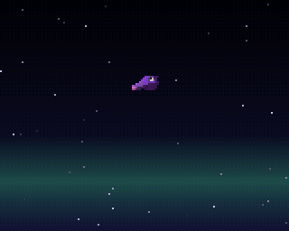

# Siwoo: a name badge cart

A name badge for Siwoo Yoon's Supabase Select badge (a Pimoroni Tufty 2350
running the Snouty Tufty OS, `~/snouty-tufty`). It also runs on the SYCL
Badge V2 and in the web simulator, like every cart here.



## What it shows

* **The head.** Demosnout's floating Snouty head (part 8) tumbles in space
  over the dithered gradient and starfield. `cart/src/head.zig` is a copy
  of `carts/demosnout/cart/src/parts/head.zig`, because the two carts are
  separate Zig modules and cannot import each other. It is moved up
  (centre (80, 46), focal 100) to leave room for the name, the tongue can
  be flicked on demand, and the background takes a glow band.
* **The name.** "SIWOO YOON" in 20 px capitals across the bottom (rows
  90..113). The font is Nimbus Sans Narrow Bold 27 px, a condensed face
  so the whole name fits 160 px on one line. It comes from
  `tools/gen_name_font.py` into the committed `cart/src/gen/name_font.zig`
  (A-Z, so the name is one const in `name.zig`). The letters are drawn as
  80s chrome: a sky half and a ground half split by a hard horizon, a dark
  1 px rim that pulses on the beat, a 3 px extrusion down-right, and a
  glow band of the theme colour in the background behind them.
* **Motion** (120 BPM frame clock, as in demosnout):
  * At boot the head flies in while the letters drop in one by one and
    bounce. The show starts at frame 136.
  * The letters ride a slow sine wave, and sparkles pop on their top
    edges.
  * Every 8 bars (16 s): a shine sweeps across (bars 0 and 4), the letters
    hop in a ripple (bar 2), and they spin in a wave (bar 6). The spin
    also moves the colours on to the next theme. Each letter changes
    colour while it shows its back, so the change rolls along the name.
* **Themes:** SUPABASE (the default, the badge's green), SUNSET (classic
  chrome), GOLD and RAINBOW.

## Controls

On the Tufty, the five buttons map 1:1 (C = Select). HOME returns to the
arcade menu.

| Button | Does |
|---|---|
| A | spin the letters, flick the tongue |
| B | next colours, and keep them there (a toast names them) |
| UP | colours change on their own again (the default) |
| DOWN | the letters hop |
| C / Select | a shine sweeps across |

## Build, run, check

From the repository root:

```sh
zig build -Dcart=siwoo           # zig-out/firmware/siwoo.uf2 (SYCL badge), zig-out/bin/siwoo.wasm
zig build test -Dcart=siwoo      # host tests: layout, dilation, mirrored draw, bounce, theme wave
zig build check-float -Dcart=siwoo
badge-bench/bench.sh zig-out/firmware/siwoo.elf   # badge-bench/carts/siwoo.toml: 1000 frames
cd carts/siwoo && node ../../tools/serve-cart.mjs # simulator (see docs/RUNNING.md at the root)
```

Preview: `node tools/preview.mjs zig-out/bin/siwoo.wasm --frames 1020
--every 3 --out /tmp/siwoo` and then `python3 tools/make_gif.py /tmp/siwoo
carts/siwoo/docs/preview.gif --scale 2 --ms 50`.

## Status (2026-10-02)

* Built, host tests and check-float pass.
* badge-bench at 150 MHz: mean 1.71 ms, worst 1.94 ms (12% of 16.7 ms).
  At the Tufty's 250 MHz that is about 1.2 ms.
* The Tufty OS runs it at crop scale (2x, rows 4..123 shown). Everything
  stays inside that window, which a host test checks. It also ships in
  the Siwoo arcade pack, `snouty-tufty-arcade-siwoo.uf2`.
* The head clock is an f32 of the frame count. Its motion stays smooth for
  days (exact to 16.7 M frames, about 77 hours).
