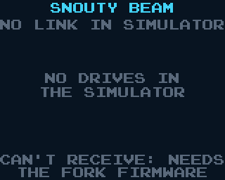

# Snouty Beam

Pass carts from badge to badge over the link cable. Pick a cart on your
badge, press A, and the other badge asks its owner whether to take it.
Once accepted, the cart is copied into the other badge's external flash,
and its menu lists it as a received cart that runs like any other.

## What you need

- Two SYCL Badge V2s with working UART headers (J4, the 3-pin JST-SH next
  to the Qwiic port) and a **JST-SH 3-pin to 3-pin cable** between them.
  Crossed or straight both work; the link works out which (docs/LINK.md).
- `snouty-beam.uf2` on both badges.
- **To send**: any firmware. The sending badge reads the cart's UF2 from
  its drive (or from SYCLEXTRA, the fork firmware's second drive).
- **To receive**: the fork firmware with cart transfer
  (adrian-computering/sycl-badge, `feature/cart-transfer`,
  fork/CART_TRANSFER.md) **and** the receive build of this cart,
  `zig build -Dcart=snouty-beam -Dbeam_receive=true`. On main the cart is
  built send-only, because receiving needs that OS change; its footer
  then reads "RECEIVING NEEDS THE FORK FIRMWARE BUILD". A receive build on
  stock firmware says "CAN'T RECEIVE: NEEDS THE FORK FIRMWARE".

## Using it

Start Snouty Beam on both badges and plug in the cable. The top line goes
from PLUG IN THE CABLE to CONNECTED (or WRONG CART: <name> when the other
badge runs another cart).

**Home.** The list holds every `.uf2` on the drives, its image size, and
the received cart (marked `*`) if this badge holds one. Up/Down picks a
row; the line under the list says what A will do, or why a cart can't
be sent:

| Reason | Meaning |
|---|---|
| XIP CART: CAN'T BEAM | an execute-in-place UF2 (`*-xip.uf2`); the slot holds RAM carts only |
| TOO BIG FOR A SLOT | its RAM image is over 252 KB |
| NOT A RAM CART, NO CART DESCRIPTOR, NOT A VALID UF2 | the OS loader would refuse it too |

The footer says whether this badge can receive and what its slot holds.

**Send.** A on a cart: PREPARING (the image checksum), then WAITING FOR
THE PARTNER TO ACCEPT, then the bar and KB/s, then SENT or why not.
Hold B to cancel.

**Receive.** The other badge shows INCOMING CART: the name, its size,
and what it replaces. A accepts, B declines; no answer in 30 s declines.
Accepting erases the old received cart at once (there is one slot). The
bar runs, then RECEIVED: open the menu (Start+Select) and the cart is
listed; run it like any other.

**Clear the slot.** Select on the received row, then A.

**Pass it on.** The received row can be sent too: badge to badge to badge.

## Speed

Stop-and-wait over 4 KB blocks at 1 Mbaud, with the receiver's flash
write (~55 ms per 4 KB) between blocks: about 29 KB/s, so Snouty Pong
(24 KB) takes about 1 s and a 150 KB cart about 5 s (host model,
PLAN.md status).

## If it goes wrong

- The cable comes out or a badge restarts mid-way: both screens say CABLE
  OUT OR PARTNER LEFT. The receiver's slot is then empty (its header is
  erased first and written last), never a half cart.
- Power lost mid-way: same, the firmware boots normally with no received
  cart.
- PARTNER CAN'T RECEIVE (FIRMWARE): the other badge runs stock firmware or
  the send-only build.
- PARTNER IS BUSY: both of you pressed A at once; try again.

## For developers

PLAN.md (protocol, screens, tests, status), `cart/src/proto.zig` (the
transfer state machines), `lib/beam_slot.zig` (the slot format and UF2
flattener), `lib/ext_flash.zig` (the fork's external flash mailbox).
`zig build test-beam` runs the transfer tests; `zig build beam-slot --
in.uf2 out.bin` writes the slot bytes a cart would become.
