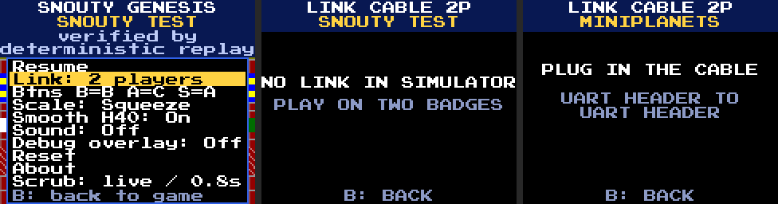

# Snouty Genesis: two players over the link cable

Two badges joined by the link cable (root docs/LINK.md: a JST-SH 3-pin
cable between the UART headers) run one Genesis in deterministic
lockstep over `lib/lockstep.zig` (root docs/LOCKSTEP.md). Both badges
hold the same console and step it with the same two pads; only one pad
byte per badge per tick crosses the cable. The host is pad 1, the guest
pad 2. Status 2026-10-05: built and host-tested (branch `genesis/link`),
never run on two badges yet (section 8 is the check).

## 1. Playing

1. Copy the same ROM file to both badges' drives and flash the same
   Snouty Genesis build on both (the RAM cart `snouty-genesis.uf2`).
2. Join the badges with the cable (either kind, crossed or straight).
3. On both: hold Select (the emulator menu), pick **Link: 2 players**
   (the second row). The link screen opens.
4. Each badge shows `YOU: PLAYER 1 (HOST)` or `YOU: PLAYER 2`. The guest
   checks the host's ROM (`ROM: SAME AS HOST`) and is ready while its
   link screen stays open; the host then reads `A: START!`. The host
   presses A (or Start): both consoles power on with the ROM and play.
5. To stop: the menu's row reads **Link: leave** during a race. The
   partner's game goes on alone (`PARTNER LEFT`, pad 2 released).

B on the link screen goes back to the game (and the badge stops being
ready). The link screen states use the shared cable wording (root
docs/LOCKSTEP.md section 6):

| Screen | Meaning |
|---|---|
| `NO LINK IN SIMULATOR` | the wasm build: no link hardware |
| `PLUG IN THE CABLE` | searching: no cable, or the partner is not running a cart that uses the link |
| `WRONG CART: <cart>` | the partner runs another link cart |
| `WRONG VERSION: UPDATE BOTH BADGES` | the partner runs another protocol version of this cart (`Game.version`) |
| `CHECKING ROM...` | this badge's ROM CRC32 is still being computed (about 2 s for 512 KB) |
| `ROM: WAITING HOST` | the guest has not heard the host's offer yet |
| `WRONG ROM` / `NEEDS THE HOST'S ROM` | the guest's ROM CRC32 differs from the host's |
| `OTHER BUILD (XIP)` | one badge runs the RAM cart, the other the XIP cart or the simulator core |
| `PARTNER: READY` / `NOT READY` | whether the partner's link screen is open with a matching ROM |
| `WAITING FOR PARTNER` | a band over the game: no tick for 0.5 s |
| `DESYNC` | the consoles' hashes differed: the race ended, back on the link screen |
| `PARTNER LEFT` | cable out, partner restarted or left: the game goes on alone |

While linked: fast forward, the chorded rewind and the scrubber are off
(they would step or rewind one badge alone); Reset and Pick ROM hide;
the menu can open but the race goes on under it with this badge's pad
released (pausing would stall the partner, and the 3-button pad leaves no
bit for lockstep's pause); Buttons, Scale, Smooth H40, Sound and Debug
overlay work (the sender maps its own buttons before the byte goes out;
the rest is render or sound only). Sound plays as usual.

## 2. Design

`cart/src/frontend/linkplay.zig` (module `linkplay`, cart-api-free and
generic over the link, so the host tests run two of them) holds the
`G` of `Lockstep(link.Badge, G)` and a `Session` wrapper;
`frontend/link_lobby.zig` draws the link screen; `frontend/app.zig`
owns the session.

- **Tick** = one badge update = the update's two Genesis frames
  (`tunables.render_every`), both with the tick's pads, the second
  rendered. The badge samples its buttons once an update anyway, and
  lockstep allows one step per frame: a frame here is the 30 Hz update.
- **Input delay** 2 ticks (67 ms, 4 Genesis frames), the lockstep
  minimum; the cable's latency is far below a tick.
- **Wire byte** (one per badge per tick): bit 0 Left, 1 Right, 2 A, 3 B,
  4 C, 5 Start, 6 Up, 7 Down (`linkplay.wire_byte` / `pad_of`). Lockstep
  clears bits 6 and 7 when both are set (they would form the SLIP bytes
  0xC0 / 0xDB); Up with Down is the one pair a d-pad never holds, so the
  clip loses nothing. 3-button pads only: a 6-button pad needs a second
  byte (X Y Z Mode) and the badge has no buttons for it. 6-button games
  (Street Fighter II and the like) play with their 3-button controls.
- **Rules** (6 bytes, the host's offer): the ROM's CRC32 (little-endian),
  the peripheral and the build variant. Peripheral: `linkplay.race_kind`
  of what `core/ports.zig` detects at power-on: a second pad (`pads2`)
  where the game would get one pad, else the game's own multitap (Team
  Player, 4 Way Play, J-Cart: pads 1 and 2 are on it or on the ports), so
  the host is pad 1 and the guest pad 2 for every game. Variant: the RAM
  cart (Z80 stub) and the full core (XIP cart, simulator) are different
  machines and never race; nor does a RAM cart built with
  `-Dgenesis_s1dac=true` (PLAN.md "Sonic 1 DAC fake") with one without
  (variant 2). A guest whose CRC or variant differs never
  readies, so the host's GO is never allowed. The embedded test ROM's
  "CRC" is 0 on both badges (embed builds).
- **App id** `'M'` (`lockstep.apps.genesis`, `SNOUTY GENESIS`),
  `Game.version` 1: bump it when the wire byte, the rules or what a tick
  does changes.
- **World** = a pointer to the frontend's static console plus a render
  flag. GO resets both consoles (`Game.start`): the agreed peripheral,
  `Md.setup.lockstep` on (the renderer's sticky sprite bits stay out of
  the state), `Md.reset` (cartridge SRAM zeroed: nothing badge-local
  survives).
- **Hash** `Md.state_hash` (the whole console minus the fetch window
  pointer and the sprite cache) every 32 ticks, about once a second:
  139,709 cycles = 0.93 ms on the badge model, once a second.
- **Partner gone** (cable out ~37 ms, partner silent 2 s, partner's cart
  restarted, or its Leave): the frontend leaves the race at once; the
  console plays on locally with pad 2 released (`PARTNER LEFT` for 2 s).
  `Game.hand_over` only records the slot (lockstep feeds a gone partner's
  slot 0).
- **Desync**: both badges stop within about 35 ticks and show the link
  screen with `DESYNC`; A starts again from power-on.

### Pumping

The link's receive buffer is the PIO's 8-byte FIFO: one input packet. A
Genesis update is 20-29 ms of emulation, so the console's poll hook
(`Md.setup.poll_hook`, `core/ports.zig`, every 64 lines: five a frame,
about every 3.5 ms) pumps the link from inside the frames; it is
installed in `begin` and stays on in solo play too (with no cable a pump
is one `link.poll`). The top of every update pumps; a tick whose
partner byte is late is retried while it still fits the update
(`tuning.link_pump_until_us` = 31 ms less the last tick's cost), else
the last frame shows again; after drawing, the update pumps until 31 ms
while a race runs or the link handshakes (a HELLO is 10 bytes). The pump
inside a frame touches only the link and the lockstep, never the console
(`step` is reentered through it: tested).

## 3. What came from branch `party`

The USB multi-badge party work (branch `party`, genesis/mp4 by
exedev-64) built the console side; its `docs/MULTIPLAYER.md` (on that
branch) documents the peripherals, the determinism audit and the
input-source seam. Byte-identical here: `core/ports.zig`,
`core/ports_table.zig`, `core/bus.zig`, `core/md.zig`, `core/tunables.zig`,
`tools/gen_ports_table.py`, `tests/ports_unit.zig`,
`tests/mp_determinism.zig`, `tests/mp_bomberman.zig`, `tests/bus_unit.zig`,
`tests/smoke.zig`, and `frontend/video.zig` (`keep_last_frame`). Not
identical: `core/rom.zig` (party's `sram_max` line is there; the header
parse no longer unrolls, a different hunk), `build.zig` (party's `party`
option, always false here, plus the link modules), `tests/all.zig` and
`tests/ram_variant.zig` (no `mp_party.zig`, plus `link_play.zig`),
`main.zig` (party's `debug_pad` line only). The party cart, its lobby,
`players.zig`, `lib/lockstep_n.zig` and `lib/party*.zig` stay on
`party`. Side effect on main: the peripheral detection runs at every
power-on, so a Team Player game (Mega Bomberman) sees its tap with pad 1
in slot A in solo play too.

## 4. RAM (the RAM cart, `-Dsound` either way)

The RAM cart holds code, data, the console and the stack in the 307 KB
window. Link play costs about 10.3 KB of code plus 0.6 KB of unwind
tables (lockstep 4.5 KB, link 2 KB, the session, screen, frontend glue
and the poll hook's call in the frame loop) and 1 KB of state (the session
600 B, the link's optional DMA ring 256 B). The cart had 1.2 KB left
beside its sound after the party core. Made room:

- `rom.parse_header` reads the header through one non-inlined byte
  reader (2,220 -> 592 B).
- The RAM cart links with `cart/cart_ram.ld`, the SDK's script with a
  20 KB stack reservation instead of 32 KB (`ram_linker_script` in
  build/os_cart.zig). Measured with `badge-bench --stack`: peak 5,860 B
  (Sonic 1 with sound, 900 updates; fast forward the same), 5,240 B
  (Miniplanets, the test ROM, the menu, About and the link screen). The
  main tree's cart peaks at 4,172 B on the same Sonic run. A race adds
  the state hash's 1.7 KB `Small` copy, outside the frame loop. Nothing
  on core 1 enforces the boundary: re-measure before adding stack use.

| RAM cart | `.text` | `.bss` | free below `__stack_limit__` | UF2 |
|---|---:|---:|---:|---:|
| main 7572b89c | 114,444 | 154,184 | 3,776 (32 KB stack) | 542,208 |
| + party core | 116,824 | 154,216 | 1,256 (32 KB stack) | |
| + link play | 125,196 | 155,184 | 3,408 (20 KB stack); -8,880 with 32 KB | 567,296 |

The UF2 grows by 25 KB (it holds the image twice), so the drive keeps
about 726 KB for ROMs beside it (was 750 KB). XIP cart `.text` 236,540
of 262,144.

## 5. Tests (`zig build test-genesis -Dcart=snouty-genesis`)

`tests/link_play.zig`, on the full core and the RAM cart's core: two
badges, each a real console and a `Session` on a `lib/link_virtual.zig`
cable, a shared microsecond clock, 30 Hz updates (one 37 us slower, one
in 150 doubled), ticks of 22 and 27 ms (29/24 for Miniplanets), the
8-byte FIFO modelled pessimistically (lib/tests/lockstep_unit.zig's),
pumps as on the badge (section 2), the poll hook reentering `step`.

- Clean cable, test ROM 900 ticks and Miniplanets 600: both consoles'
  hashes equal at every 4th tick and equal to a third console fed the
  bytes both badges submitted (host pad 1, guest pad 2). Stalled updates
  3 + 0 of 903 + 900 (never two in a row), race start without a wait.
- 1% byte loss (284 bytes lost, 100 FIFO overflows): in sync, 2 + 5
  stalled updates of about 900, never two in a row.
- Cable out: `peer_left` on both 37 ms later, the race goes on solo with
  pad 2 released and the slot handed over.
- Leave: the partner sees `peer_left` (quit), both back in the lobby, a
  rematch in sync.
- Desync (one console's work RAM changed): found on both 35 ticks later.
- Wrong ROM (the guest never readies), other build (`OTHER BUILD`), a
  guest leaving its link screen (no longer ready, no GO), wrong cart
  (`SNOUTY PONG`).
- The wire byte: every byte but Up+Down survives, the guest's pad lands
  on pad 2, the rules round trip.

## 6. Performance (badge-bench, calibrated busy ms, RAM cart)

A solo game is unchanged (the poll hook is a pointer test and a
`link.poll` five times a frame):

| Run | main mean / max | link build mean / max |
|---|---:|---:|
| test ROM `m2_play` (156) | 8.75 / 24.28 | 8.74 / 24.03 |
| Miniplanets `m2_mini300` (336) | 15.11 / 23.43 | 15.04 / 23.66 |
| Sonic 1 `snd_sonic1`, sound on (900) | 19.68 / 32.58 | 19.59 / 32.39 |

A race adds the state hash (0.93 ms on one update a second) and a few
microseconds of pumps per update; the update then busy-waits pumping
until 31 ms. Sonic 1's worst update (Green Hill's first seconds, 32.4 ms)
plus a hash would just reach the 33.3 ms budget: at worst one late update
a second there, which lockstep absorbs (the partner waits a few ms).
badge-bench has no link hardware, so a race itself is not benched.

## 7. Limits

- Two players, 3-button pads. Team Player and 4 Way Play games get their
  multitap with two humans on it; 3+ humans need the party branch.
- The RAM cart plays drive ROMs up to 768 KB and the drive has about
  726 KB beside the UF2: 1 MB two-player games (Mega Bomberman, Sonic 2,
  Gunstar Heroes) do not fit (the ext-flash drive may change that).
- Both badges run the same build. The XIP cart (dead on the show
  firmware) shows the Link row only where Pick ROM is hidden (embed
  builds; the simulator has it), as a tenth row would take its scrub
  line's place.
- No pause in a race; the menu leaves it running.

## 8. Hardware check (two badges, one cable)

1. Flash the same `snouty-genesis.uf2` (`zig build -Dcart=snouty-genesis`)
   on both and put the same ROM on both drives: Sonic 1 for a sync check
   (the host plays, the guest watches the same game), then a two-player
   game that fits (Columns, Streets of Rage or Golden Axe, 128-512 KB;
   untested here: no ROMs on the VM) for pad 2.
2. Join the UART headers, open **Link: 2 players** on both. Expect `YOU:
   PLAYER 1 (HOST)` on one and `PLAYER 2` on the other within a second,
   `ROM: SAME AS HOST`, `PARTNER: READY`, then `A: START!` on the host.
3. Host presses A: both restart the game at once. Look for: both screens
   showing the same frames (watch a timer or the rings counter), the
   guest's pad driving player 2 in the two-player game, sound on both
   with Sound on, no `WAITING FOR PARTNER` band in normal play, no
   `DESYNC` over several minutes (one would end the race on both).
4. Open the menu on one badge during play: the game goes on on both
   (that badge's player stands still). Choose Link: leave: the other
   badge shows `PARTNER LEFT` and plays on alone.
5. Start again and pull the cable mid-game: both show `PARTNER LEFT`
   within a fraction of a second and play on.
6. Different ROMs on the two drives: the guest shows `WRONG ROM`, the
   host never `A: START!`.
7. Debug overlay on (menu): update times stay under 33 ms in a race; the
   occasional hash update is about 1 ms more.
