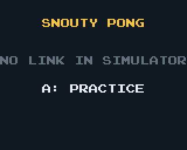

# Snouty Pong: how to make a two-badge game

The smallest multiplayer cart in this repository, written to be read. Two
badges joined by a link cable play Pong; each player moves one paddle. It
uses the same approach as Snouty GC, Cycles, Zero and Snoutenstein:
**deterministic lockstep** over `lib/lockstep.zig`.



## The idea in one paragraph

Both badges hold the same game state (the World) and run the same
`simulate` function on it, 60 times a second. The only thing that crosses
the cable is one input byte per player per tick. Each badge waits until it
has both bytes for a tick, then steps. Same start, same inputs, same code:
the two Worlds stay identical without ever being sent. The lockstep
library does the networking: finding the partner, the lobby, input delay,
resends, desync detection, and noticing when the partner leaves.

## The three files

| File | What | Lines |
|---|---|---|
| [`cart/src/pong.zig`](cart/src/pong.zig) | the game: `World`, `simulate`, plus the four decls the lockstep needs | 170 |
| [`cart/src/main.zig`](cart/src/main.zig) | the cart: frame loop, lobby, drawing | 260 |
| [`cart/src/pong_test.zig`](cart/src/pong_test.zig) | host tests: two badges on a virtual cable play a match | 110 |

## Step 1: a deterministic game

`pong.zig` never touches the cart API. `simulate(w, in)` reads only the
World and the two input bytes, so the same bytes always give the same
World. Keep it that way:

- **No clock, no `cart.rand()`.** Randomness comes from an RNG stored *in*
  the World, seeded from `ls.seed()` (the same on both badges).
- **No floats.** Positions are integers in 1/16 pixel.
- **Only `simulate` writes the World** during a match (and `hand_over`,
  below). Drawing reads it and nothing else.
- **Inputs are bytes you define.** Pong's is `packed struct(u8) { up, down }`.
  Never set bits 6 and 7 together (the lockstep reserves that pattern).

## Step 2: tell the lockstep about the game

`Lockstep(L, G)` takes the link type and a namespace `G`. Pong's `G` is
the `pong.zig` file itself:

```zig
pub const rules_len = 1;           // bytes of rules the host picks (points to win)
pub const input_delay: u32 = 2;    // a press drives the tick 2 frames later
pub fn simulate(w: *World, in: [2]u8) void { ... }  // in[0] host, in[1] guest
pub fn hash(w: *const World) u32 { return lockstep.hash_fields(World, w); }
pub fn hand_over(w: *World, slot: u1) void { w.cpu[slot] = true; } // partner left
```

and in `main.zig`:

```zig
const Lockstep = lockstep.Lockstep(link.Badge, pong);
ls = .init(link.Badge.init(.{}, lockstep.apps.pong, nonce));
```

`hash` lets the two badges compare Worlds now and then; if they ever
differ, the state becomes `.desync` instead of two players silently
seeing different games.

## Step 3: the frame loop

Every frame, in this order (`update` in `main.zig`):

1. **`ls.pump(now)`** at the top. The link's receive buffer is only 8
   bytes, so the cart has to read it often.
2. **Lobby** (`menu`): the host offers rules with `ls.set_rules`, both
   badges say they are ready with `ls.set_pick(0, ready)`, and the host
   calls `ls.go(now)` once `ls.can_go()`. **`ls.take_started()`** returns
   true once on *both* badges: build the World from `ls.rules()` and
   `ls.seed()` right then.
3. **Match** (`match`): `ls.submit(now, my_byte)`, then `ls.step(&world)`.
   `step` runs at most one tick and returns false if the partner's byte
   has not arrived yet (just draw the same World again).
4. **Draw.** Your paddle is `ls.local_slot()` (0 = host = left).
5. **Late pump**: while `ls.wants_pump()`, keep pumping (and retrying a
   stalled `step`) until 14 ms into the frame. That covers the vsync wait,
   when nothing else would read the cable.

Leaving is `ls.leave(now)`; the partner sees `.peer_left`, the lockstep
calls `hand_over`, and its CPU plays the empty paddle to the end.

## Step 4: show the link's state

`ls.state()` says what to put on screen. Use the shared wording so every
cart reads the same:

| State | Screen |
|---|---|
| `offline` | NO LINK IN SIMULATOR |
| `searching` | PLUG IN THE CABLE |
| `wrong_cart` | WRONG CART: `ls.partner_name()` |
| `wrong_version` | WRONG VERSION: UPDATE BOTH BADGES |
| `lobby` | your lobby |
| `racing` | the game |
| `waiting` | WAITING FOR PEER (over the game) |
| `peer_left` | PEER LEFT, CPU PLAYS |
| `desync` | end the round |

## Step 5: test it without badges

`pong_test.zig` runs two badges on `lib/link_virtual.zig`'s cable on the
host, with bots holding the buttons, and checks that both Worlds end up
identical; a second test pulls the cable mid-match and checks the CPU
finishes the game on both sides. Most lockstep bugs (a `cart.rand()` in
`simulate`, a World write in the draw code) show up here as unequal
Worlds, long before two badges are on a desk.

```sh
zig build test -Dcart=snouty-pong
```

## Run it

From the repository root (setup: [docs/RUNNING.md](../../docs/RUNNING.md)):

```sh
zig build -Dcart=snouty-pong
```

- **Badge**: copy `zig-out/firmware/snouty-pong.uf2` to two badges
  ([docs/INSTALL.md](../../docs/INSTALL.md)) and join their UART headers
  (J4) with a JST-SH 3-pin cable, straight or crossed
  ([docs/LINK.md](../../docs/LINK.md)). Both press A in the lobby; the host
  (left paddle) picks the points with Up/Down. Up/Down move your paddle,
  B quits.
- **Simulator**: there is no cable, so A starts a practice game against
  the CPU. `cd carts/snouty-pong && node ../../tools/serve-cart.mjs`, then
  `npm run dev` in `sycl-badge/simulator`.

## Making your own

1. Copy this directory, rename it, and add it to the `carts` list in the
   root `build.zig`.
2. Take a free letter in `lockstep.apps` and `lockstep.app_name`
   (`lib/lockstep.zig`, and the table in docs/LOCKSTEP.md section 6), so
   two different carts never pair up.
3. Replace `pong.zig` with your game, keeping the step 1 rules.
4. Change `version` in your `G` (`pub const version: u4 = 1;`) whenever
   the meaning of the input bytes, the rules or `simulate` changes, so an
   old and a new build refuse to play together.

Everything else (pause, wider picks, more rules bytes, timing) is in
[docs/LOCKSTEP.md](../../docs/LOCKSTEP.md). Bigger examples:
`carts/snouty-cycles/cart/src/net.zig` and `carts/snouty-gc`.
