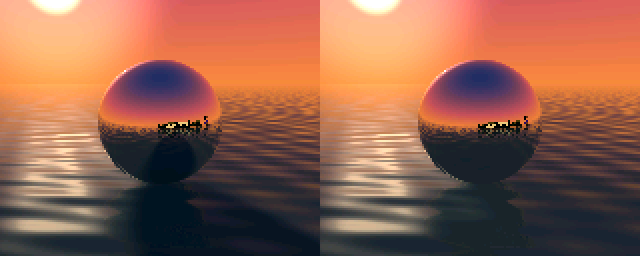
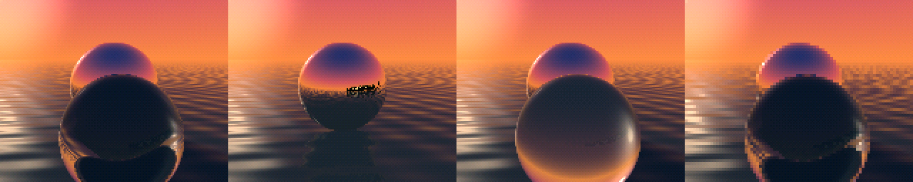

# M2.1 perf variants

**Shipped: `cut20`** (Adrian, 2026-09-29) is the default build; pass
`-Dreflections_variant=<name>` for the others.

The full M2 scene (glass, shore, water shadows) is 74.85 ms at worst, and the
20 fps budget is 47 ms. These are three ways to fit it, built from one tree
for side-by-side comparison, plus the over-budget baseline. PLAN.md "M2.1 Perf
variants" has the contract; `cart/src/variant.zig` has the settings.

M2.2 update (names, skyline, Iris logo): full20 73.88, cut20 46.33, full15
58.05, half30 22.57 ms worst; the table below is the M2.1 measurement.

| variant  | res          | fps | scene                                    | worst ms (frame) | mean ms | budget | verdict |
|----------|--------------|-----|------------------------------------------|------------------|---------|--------|---------|
| `full20` | 160x128      | 20  | everything (M2 baseline)                 | 75.00 (531)      | 60.09   | 47.0   | over    |
| `cut20`  | 160x128      | 20  | no glass sphere, no water shadows        | 45.37 (558)      | 42.43   | 47.0   | ok      |
| `full15` | 160x128      | 15  | everything; glass seen directly looks its two rays up (knob 4) | 57.19 (257) | 53.78 | 62.7 | ok |
| `half30` | 80x64, 2x2   | 30  | everything                               | 20.81 (799)      | 17.07   | 31.3   | ok      |

Calibrated badge-bench busy ms, one full orbit (30 s) per variant, default
Bayer dither. Budgets are 94% of the frame period. Every variant passes
`check_render` against the reference on frames 0, 1/4, 1/2, 3/4 of the
orbit and on its worst frame.

`cut20` first kept depth-0 shadows as planned (47.97 ms, 0.97 over), so its
shadows were turned off entirely. `half30` has 10 ms of spare time; locking it
to 20 fps instead would leave 26 ms for more features.

What `cut20` loses besides the glass: the spheres' shadows on the water.
They are clearest while the camera faces the sun, as a darker wedge on the
water beyond the sphere (also visible in its reflection) with less glitter;
with the sun behind the camera they are mostly hidden behind the sphere. Reference frame 525,
shadows on (left) and off (right):

The same moment (25.2 s into the orbit) in each, left to right: full20, cut20,
full15, half30.

One-orbit GIFs, sampled every 0.6 s of scene time (so they play 6x fast and
show equal scene time): `variant_full20.gif`, `variant_cut20.gif`,
`variant_full15.gif`, `variant_half30.gif`.
