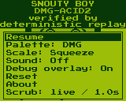
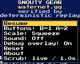
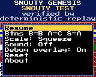

# Review validation and reproduction

These are review probes and recorded results, not proposed implementation changes. Commands used the existing pinned Zig and local fixture availability. Expected-failure probes deliberately assert the desired boundary and fail on the reviewed code. Hardware behavior remains unverified.

## ROMFS range probe

```zig
const std = @import("std");
const romfs = @import("romfs");

test "review probe geometry must not map outside the badge volume" {
    var boot = std.mem.zeroes([512]u8);
    std.mem.writeInt(u16, boot[510..512], 0xaa55, .little);
    std.mem.writeInt(u16, boot[11..13], 512, .little);
    boot[13] = 1;
    std.mem.writeInt(u16, boot[14..16], 3000, .little);
    boot[16] = 2;
    std.mem.writeInt(u16, boot[17..19], 32, .little);
    std.mem.writeInt(u16, boot[19..21], 4000, .little);
    std.mem.writeInt(u16, boot[22..24], 8, .little);
    @memcpy(boot[54..62], "FAT12   ");
    const vol = try romfs.Volume.open(&boot);
    var clusters: [1]u16 = undefined;
    const mapped = try vol.map(.{ .size = 512, .first_cluster = 2 }, &clusters);
    const offset = @intFromPtr(mapped.data_base) - @intFromPtr(&boot);
    std.debug.print("mapped offset={d}, physical volume={d}\n", .{offset, romfs.size});
    try std.testing.expect(offset < romfs.size);
}
```

## Manager boundary probes

```python
import http.client
import pathlib
import struct
import sys
import tempfile
import threading
from unittest.mock import patch

sys.path.insert(0, '/home/exedev/snouty-badge/badge-manager')
from badge_manager.server import make_server
from badge_manager.library import validate_uf2
from badge_manager import device

class FakeStation:
    def __init__(self): self.called = threading.Event()
    def status(self): return {'busy': False}
    def wipe(self): self.called.set()
    def log(self, msg): pass

station = FakeStation()
server = make_server(station, '127.0.0.1', 0)
thread = threading.Thread(target=server.serve_forever, daemon=True)
thread.start()
try:
    conn = http.client.HTTPConnection('127.0.0.1', server.server_port, timeout=3)
    conn.request('POST', '/api/wipe', body='{}', headers={
        'Origin': 'http://unrelated.example', 'Content-Type': 'text/plain'})
    reply = conn.getresponse()
    print('foreign-origin text/plain wipe:', reply.status, reply.read(),
          'action invoked:', station.called.wait(1))
    conn.close()
finally:
    server.shutdown()
    server.server_close()

with tempfile.TemporaryDirectory() as tmp:
    p = pathlib.Path(tmp) / 'invalid.uf2'
    block = bytearray(512)
    struct.pack_into('<8I', block, 0, 0x0A324655, 0x9E5D5157, 0x2000,
                     0x20035100, 477, 0, 1, 0xE48BFF59)
    struct.pack_into('<I', block, 508, 0x0AB16F30)
    p.write_bytes(block)
    print('invalid 477-byte UF2 payload accepted as:', validate_uf2(p))

with patch.object(device, '_by_label', return_value='/dev/not-a-badge'), \
     patch.object(device, '_by_usb_id', side_effect=AssertionError('USB check called')):
    print('label-only discovery selects:', device.find_badge().device)
```

## Emulator header probes

```zig
const std = @import("std");
const mdrom = @import("mdrom");
const lynxcart = @import("lynxcart");
test "review: malformed Genesis length must be rejected" {
    var bytes: [512]u8 = @splat(0);
    @memcpy(bytes[0x100..0x104], "SEGA");
    @memset(bytes[0x1a4..0x1a8], 0xff);
    const src = mdrom.RomSource.from_slice(&bytes);
    try std.testing.expectEqual(mdrom.Refusal.mapper, mdrom.check(&src));
}
test "review: oversized headered Lynx must be rejected" {
    var head: [64]u8 = @splat(0);
    @memcpy(head[0..4], "LYNX");
    head[5] = 2; // bank 0 block size = 512
    const parsed = lynxcart.parse(&head, 600 * 1024);
    try std.testing.expectEqual(lynxcart.Refusal.too_big, parsed.verdict);
}
```

## Reproduction commands

Save the preceding probe snippets under the `/tmp` names shown in these commands. The manager probe uses a fake server and temporary UF2 only; no physical device is opened.

```sh
zig test --dep romfs -Mroot=/tmp/sycl-review-romfs-bounds.zig -Mromfs=/home/exedev/snouty-badge/lib/romfs.zig
python3 /tmp/sycl-review-manager-probes.py
zig test -O ReleaseSafe --dep mdrom --dep lynxcart -Mroot=/tmp/sycl-review-rom-probe.zig -Mmdrom=/home/exedev/snouty-badge-genesis/carts/snouty-genesis/core/rom.zig -Mlynxcart=/home/exedev/snouty-badge-lynx/carts/snouty-lynx/core/cart.zig --test-filter Genesis
zig test -O ReleaseSafe --dep mdrom --dep lynxcart -Mroot=/tmp/sycl-review-rom-probe.zig -Mmdrom=/home/exedev/snouty-badge-genesis/carts/snouty-genesis/core/rom.zig -Mlynxcart=/home/exedev/snouty-badge-lynx/carts/snouty-lynx/core/cart.zig --test-filter Lynx
```

The Lynx assertion expresses a proposed padding/size policy; accepting trailing data may be intentional. It is a decision point, not proof of an immediate crash.

## Production fallback probe

The parent also reproduced UX-02 without initializing a real station or starting a server:

```python
import sys
from unittest.mock import patch
sys.path.insert(0, '/home/exedev/snouty-badge/badge-manager')
from badge_manager import server
from badge_manager.config import Config

with patch.object(server, '_load_config', return_value=Config()), \
     patch('badge_manager.station.Station',
           side_effect=PermissionError('review startup failure')), \
     patch.object(server, 'serve') as serve:
    rc = server.main([])
    print('return code:', rc)
    print('station served:', type(serve.call_args.args[0]).__name__)
```

Observed `return code: 0` and `station served: DemoStation`, with the failure and demo switch only logged. This probe mocks the real Station constructor and HTTP serving; no physical badge is accessed.

## Recorded commands and outcomes

| Check | Outcome | Evidence |
|---|---|---|
| Main `zig build -j2 --prefix /tmp/sycl-review-build --summary all` | 152/152 steps passed | [Build log](evidence/sycl-review-build.log) |
| Main `zig build test -j2 --cache-dir /tmp/sycl-review-tests-cache --summary all` | 461/462 reported passed; Demosnout tie assertion failed; optional oracle cases include successful early returns | [Fresh cache log](evidence/sycl-review-clean-host-tests.log) |
| Main `zig build check-float -j2 --prefix /tmp/sycl-review-build --summary all` | 156/156 steps passed; Reflections, Maze, Demosnout default RAM artifacts checked | [Float log](evidence/sycl-review-float.log) |
| XIP-only Reflections `check-float` with empty output prefix | Failed on missing RAM ELF after building XIP | [XIP log](evidence/sycl-review-xip-check.log) |
| Manager `python3 -m unittest discover -s tests` from badge-manager | 137 tests passed after sandbox restriction was removed | [Manager log](evidence/sycl-review-manager-tests.log) |
| Snoutenstein takeover at update1900 | Rewinds=2 instead of1; desync=1 | [Probe log](evidence/sycl-review-snoutenstein-takeover.log) |
| Main Boy with existing later serial tests | External-clock assertion failed | [Serial log](evidence/sycl-review-boy-serial-probe.log) |
| Branch Genesis `test-genesis` | 168 tests passed with documented oracle exclusions | [Genesis log](evidence/sycl-genesis-tests.log) |
| Branch Lynx `test-lynx` | 108 tests passed; 240000 oracle cases from24 files, not the full universe | [Lynx log](evidence/sycl-lynx-tests.log) |
| Flyover repeated skips | Position became negative and world check failed | [Frame metadata](evidence/flyover-overflow.json), [inputs](evidence/flyover-input.json) |
| ROMFS malformed geometry | Returned offset1545216 beyond physical1310720 | [Bounds log](evidence/sycl-review-romfs-bounds.log) |
| Manager fake boundary tests | Foreign-origin wipe invoked; invalid UF2 accepted; label-only device selected | [Probe log](evidence/sycl-review-manager-probes.log) |
| Genesis malformed header | ReleaseSafe integer-overflow abort | [Header log](evidence/sycl-review-genesis-probe.log) |
| Lynx oversized header | Accepted/clipped instead of too_big | [Header log](evidence/sycl-review-lynx-probe.log) |

Other checks and exact commands are recorded in [games.md](games.md) and [emulators.md](emulators.md). Some Zig logs print `failed command` after stderr even for passing tests; use the exit status and final summary. Counts for nested oracle cases must not be added to host-test totals.

## Menu screenshots

Fresh main wasm frames after holding Select. These support the discoverability review and do not establish physical readability or screen-reader behavior.

| Boy | Gear | Genesis |
|---|---|---|
|  |  |  |
